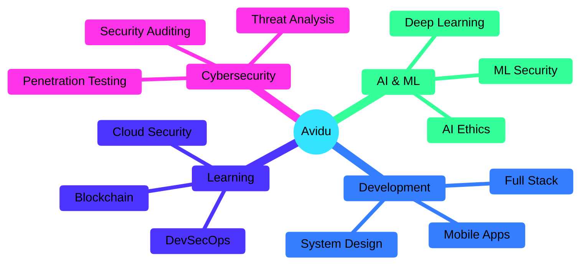

# <div align="center"></div>

<div align="center">
  


[](https://github.com/avidzcheetah)

</div>

---


###  **DIGITAL ARCHITECT**

```rust
struct Developer {
    name: &'static str,
    location: &'static str,
    role: &'static str,
    mission: &'static str,
}

impl Developer {
    fn new() -> Self {
        Self {
            name: "Avidu Witharana",
            location: "Sri Lanka 🇱🇰",
            role: "Computer Engineering Student",
            mission: "Building secure AI-powered systems",
        }
    }
    
    fn get_expertise(&self) -> Vec<&str> {
        vec![
            "Penetration Testing",
            "Machine Learning Security",
            "Full-Stack Development",
            "System Architecture",
        ]
    }
}
```

<br clear="right"/>

---

##  **TECH STACK**

<details open>
<summary><b>💻 Core Languages</b></summary>
<br>


</details>

<details open>
<summary><b>🌐 Web & Mobile</b></summary>
<br>


</details>

<details open>
<summary><b>🤖 AI/ML & Data</b></summary>
<br>


</details>

<details open>
<summary><b>⚙️ Systems & Tools</b></summary>
<br>


</details>

---

##  **GITHUB STATS**

<div align="center">
  
  
</div>

<div align="center">
  
  
</div>

---

## 🏆 **ACHIEVEMENTS**

<div align="center">
  
[](https://github.com/avidzcheetah)

</div>

---

## 🎯 **CURRENT FOCUS**



---

## 🌐 **CONNECT WITH ME**

<div align="center">

[](https://linkedin.com/in/avidz)
[](https://fb.com/avidzxv)
[](https://www.youtube.com/@avidzxv)
[](mailto:avidu@ieee.org)

</div>

---

## 💭 **PHILOSOPHY**

<div align="center">

```ascii
╔══════════════════════════════════════════════════════════╗
║                                                          ║
║  "Security by design, innovation by passion"            ║
║                                                          ║
║  🐆 In the race between security and threats,           ║
║     I choose to be the cheetah                          ║
║                                                          ║
╚══════════════════════════════════════════════════════════╝
```

</div>

---

<div align="center">

### 🌟 **"Chasing miracles through cyberspace, one secure line of code at a time"** 🌟


**Made with 🖤 by Avidu Witharana**


</div>
