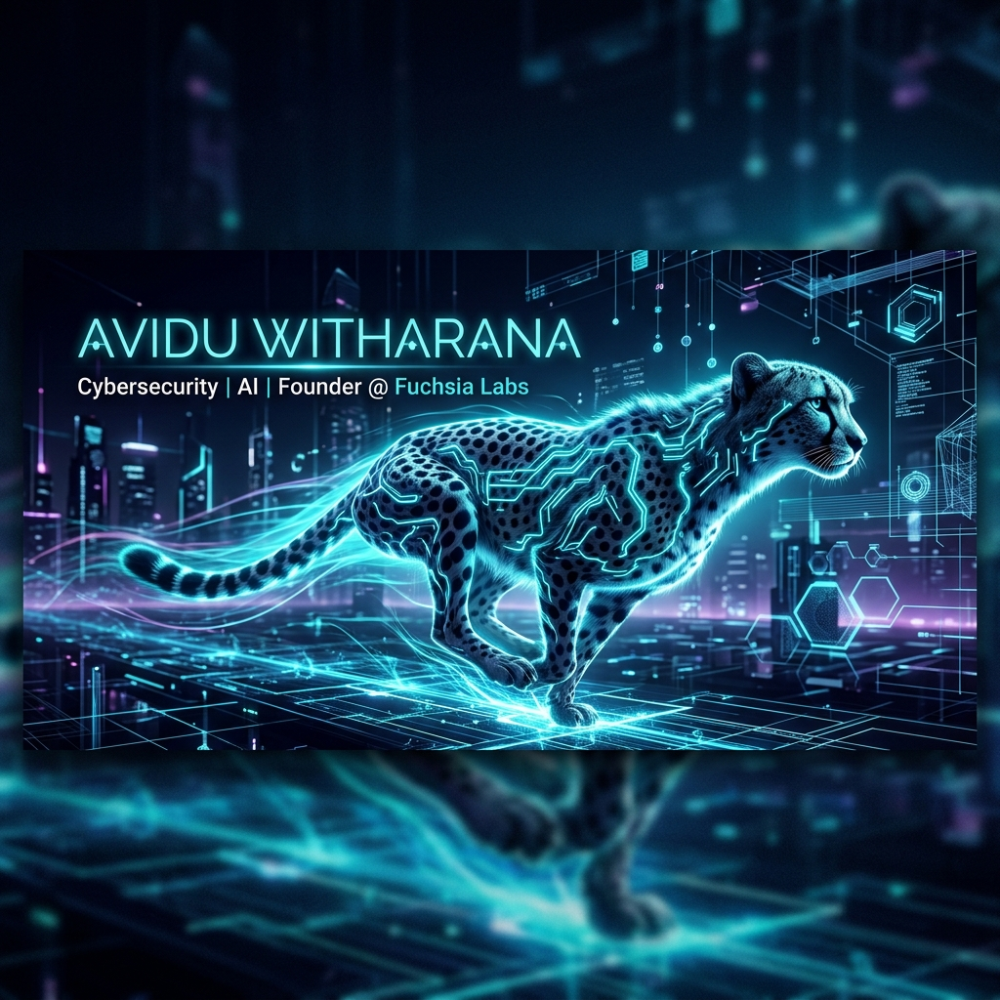
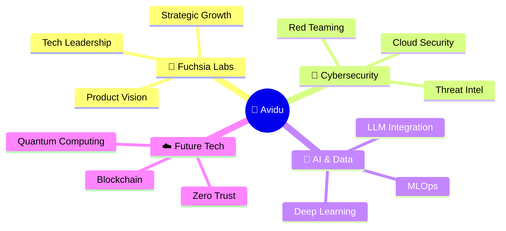

<div align="center">

<!-- Hero Banner -->


<!-- Typing animation -->
<a href="https://git.io/typing-svg">
  
</a>

<br/>

<!-- Profile badges -->
[](https://github.com/avidzcheetah)
[](https://github.com/avidzcheetah?tab=followers)
[](https://linkedin.com/in/avidz)

</div>

---

## 🐆 &nbsp;About Me

```typescript
const avidu: Entrepreneur = {
  name:       "Avidu Witharana",
  alias:      "avidzcheetah",
  role:       "Founder @ Fuchsia Labs 🚀",
  study:      "Computer Engineering Student",
  location:   "Sri Lanka 🇱🇰",
  
  mission:    "Building the future of secure, AI-powered systems.",
  expertise:  [
    "Cybersecurity & Penetration Testing",
    "AI / Deep Learning Architecture",
    "Full-Stack System Engineering",
    "Founder & Strategic Lead"
  ],

  currently:  ["Scaling Fuchsia Labs", "Developing AI-BusBook (Gaman)", "Mastering DevSecOps"],
  philosophy: "In the digital race, be the cheetah — fast, precise, and unstoppable."
};
```

<br/>

---

## 🛠️ &nbsp;Tech Stack

<div align="center">

### 💻 Languages & Logic


### 🌐 Web & Mobile Mastery


### 🤖 AI, Security & DevOps


</div>

---

## 📊 &nbsp;GitHub Pulse

<div align="center">


<br/>


</div>

---

## 🏆 &nbsp;Achievements

<div align="center">

[](https://github.com/avidzcheetah)

</div>

---

## 🎯 &nbsp;Strategic Roadmap


```mermaid
mindmap
  root((🐆 Avidu))
    🚀 Fuchsia Labs
      Product Vision
      Strategic Growth
      Tech Leadership
    🔐 Cybersecurity
      Red Teaming
      Threat Intel
      Cloud Security
    🤖 AI & Data
      Deep Learning
      LLM Integration
      MLOps
    ☁️ Future Tech
      Blockchain
      Zero Trust
      Quantum Computing
```

---

## 🌐 &nbsp;Let's Connect

<div align="center">

[](https://linkedin.com/in/avidz)
[](https://www.youtube.com/@avidzxv)
[](https://fb.com/avidzxv)
[](mailto:avidu@ieee.org)

</div>

---

<div align="center">

<!-- Snake animation -->
<picture>
  <source media="(prefers-color-scheme: dark)" srcset="https://raw.githubusercontent.com/avidzcheetah/avidzcheetah/output/github-contribution-grid-snake-dark.svg" />
  <source media="(prefers-color-scheme: light)" srcset="https://raw.githubusercontent.com/avidzcheetah/avidzcheetah/output/github-contribution-grid-snake.svg" />
  
</picture>

<br/>

```
╔═══════════════════════════════════════════════════════════╗
║                                                           ║
║   "Security by design, innovation by passion"            ║
║                                                           ║
║   🐆 Fast, precise, always ahead of the threat           ║
║                                                           ║
╚═══════════════════════════════════════════════════════════╝
```


</div>
