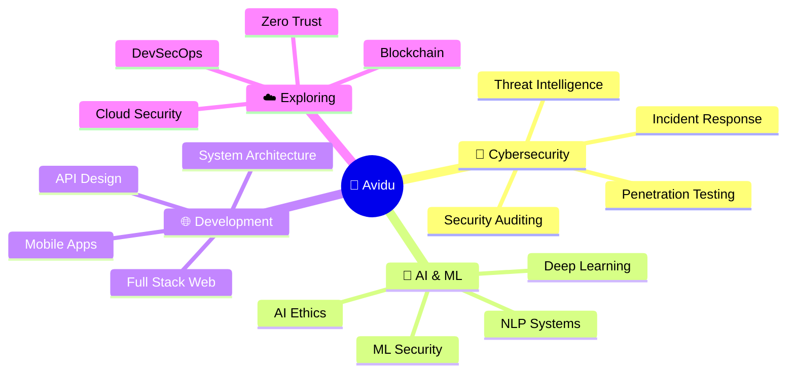

<div align="center">

<!-- Animated Banner -->


<!-- Typing animation -->
<a href="https://git.io/typing-svg">
  
</a>

<br/>

<!-- Profile badges -->

[](https://github.com/avidzcheetah?tab=followers)
[](https://linkedin.com/in/avidz)

</div>

---

##  &nbsp;About Me

```typescript
const avidu: Developer = {
  name:       "Avidu Witharana",
  alias:      "avidzcheetah 🐆",
  location:   "Sri Lanka 🇱🇰",
  role:       "Computer Engineering Student",
  
  expertise:  [
    "Cybersecurity & Penetration Testing",
    "AI / Machine Learning Systems",
    "Full-Stack Web Development",
    "Mobile Development (Flutter & Android)",
  ],

  currentlyLearning: ["DevSecOps", "Cloud Security", "Blockchain"],
  
  philosophy: "In the race between security and threats — be the cheetah.",
};
```

<br/>

---

## 🧠 &nbsp;Tech Stack

<table>
  <tr>
    <td valign="top" width="33%">

**💻 Languages**


</td>
<td valign="top" width="33%">

**🌐 Web & Mobile**


</td>
<td valign="top" width="33%">

**🤖 AI / Security / Tools**


</td>
  </tr>
</table>

---

## 📊 &nbsp;GitHub Stats

<div align="center">


&nbsp;&nbsp;


<br/><br/>


&nbsp;&nbsp;


</div>

---

## 🏆 &nbsp;Achievements

<div align="center">

[](https://github.com/avidzcheetah)

</div>

---

## 🎯 &nbsp;Focus Areas


```mermaid
mindmap
  root((🐆 Avidu))
    🔐 Cybersecurity
      Penetration Testing
      Threat Intelligence
      Security Auditing
      Incident Response
    🤖 AI & ML
      Deep Learning
      ML Security
      NLP Systems
      AI Ethics
    🌐 Development
      Full Stack Web
      Mobile Apps
      System Architecture
      API Design
    ☁️ Exploring
      DevSecOps
      Cloud Security
      Blockchain
      Zero Trust
```

---

## 🚀 &nbsp;Featured Projects

<div align="center">

[](https://github.com/avidzcheetah)

</div>

> 💡 *More projects pinned below on my profile!*

---

## 🌐 &nbsp;Connect With Me

<div align="center">

[](https://linkedin.com/in/avidz)
[](https://www.youtube.com/@avidzxv)
[](https://fb.com/avidzxv)
[](mailto:avidu@ieee.org)

</div>

---

<div align="center">

<!-- Snake animation -->
<picture>
  <source media="(prefers-color-scheme: dark)" srcset="https://raw.githubusercontent.com/avidzcheetah/avidzcheetah/output/github-contribution-grid-snake-dark.svg" />
  <source media="(prefers-color-scheme: light)" srcset="https://raw.githubusercontent.com/avidzcheetah/avidzcheetah/output/github-contribution-grid-snake.svg" />
  
</picture>

<br/>

```
╔═══════════════════════════════════════════════════════════╗
║                                                           ║
║   "Security by design, innovation by passion"            ║
║                                                           ║
║   🐆 Fast, precise, always ahead of the threat           ║
║                                                           ║
╚═══════════════════════════════════════════════════════════╝
```


</div>
