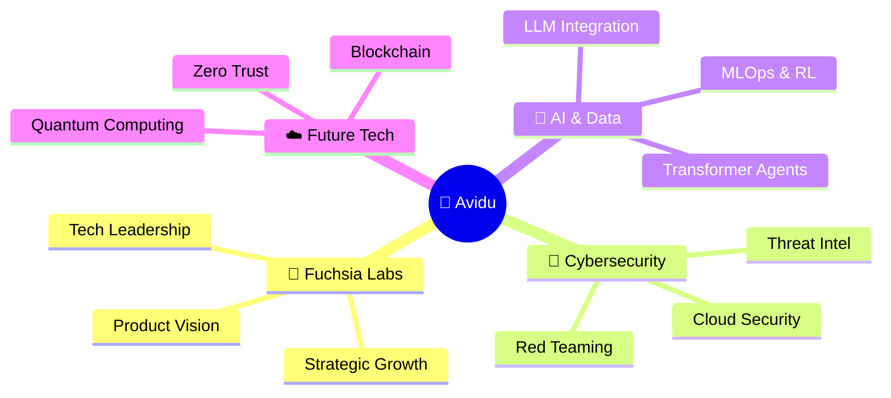

<div align="center">


<br/>

<a href="https://github.com/avidzcheetah">
  
</a>

<br/><br/>

<a href="https://github.com/avidzcheetah"></a>
&nbsp;
<a href="https://github.com/avidzcheetah?tab=followers"></a>
&nbsp;
<a href="https://linkedin.com/in/avidz"></a>
&nbsp;
<a href="https://fuchsialabs.xyz"></a>

</div>


<br/>

## 🐆 &nbsp;About Me

```typescript
const avidu: Entrepreneur = {
  name:       "Avidu Witharana",
  alias:      "Avidz",
  role:       "Founder @ Fuchsia Labs 🚀",
  study:      ["Computer Engineering", "BSc IT & Cybersecurity"],
  location:   "Sri Lanka 🇱🇰",

  mission:    "Engineering extreme capabilities — AI × Security × Full-Stack.",
  expertise:  [
    "Cybersecurity & Penetration Testing",
    "AI / Deep Learning Architecture",
    "Full-Stack System Engineering",
    "Founder & Strategic Lead"
  ],

  currently:  [
    "Scaling Fuchsia Labs",
    "Building Smarter Solutions",
    "Transformer-Based SOC Automation Research",
    "Mastering AI, Full-Stack and CySec"
  ],

  philosophy: "In the digital race, be the cheetah - fast, precise, and unstoppable."
};
```

<br/>

---

## 🚀 &nbsp;Featured Projects

<div align="center">

| Project | Description | Stack |
|:---|:---|:---|
| 🚌 **[BusBook.site](https://busbook.site)** | Sri Lanka's first AI-powered bus booking aggregator | Next.js · Supabase · AI |
| 📸 **Velora** | Photorealistic AI photoshoot generation platform | SD-XL · LoRA · React |
| 🎥 **JamHub** | Real-time WebRTC video collaboration workspace | Node.js · WebRTC · Vercel |
| 🔐 **SOC Automation Agent** | BERT + DQN transformer agent for incident response | PyTorch · Wazuh · FastAPI |
| 🌐 **Fuchsia Labs CMS** | AI-integrated CMS with 8 core modules | Next.js · PostgreSQL · Redis |

</div>

<br/>

---

## 🛠️ &nbsp;Tech Stack

<div align="center">

### 💻 Languages & Logic


### 🌐 Web & Mobile


### 🤖 AI · Security · DevOps


</div>

<br/>

---

## 📊 &nbsp;GitHub Pulse

<div align="center">


&nbsp;


<br/><br/>


&nbsp;


</div>

<br/>

---

## 🏆 &nbsp;Achievements

<div align="center">


</div>

<br/>

---

## 🎯 &nbsp;Strategic Roadmap


```mermaid
mindmap
  root((🐆 Avidu))
    🚀 Fuchsia Labs
      Product Vision
      Strategic Growth
      Tech Leadership
    🔐 Cybersecurity
      Red Teaming
      Threat Intel
      Cloud Security
    🤖 AI & Data
      Transformer Agents
      LLM Integration
      MLOps & RL
    ☁️ Future Tech
      Blockchain
      Zero Trust
      Quantum Computing
```

<br/>

---

## 🌐 &nbsp;Let's Connect

<div align="center">

<a href="https://linkedin.com/in/avidz"></a>
&nbsp;
<a href="https://www.youtube.com/@avidzxv"></a>
&nbsp;
<a href="https://fb.com/avidzxv"></a>
&nbsp;
<a href="mailto:avidu@ieee.org"></a>
&nbsp;
<a href="https://fuchsialabs.xyz"></a>

</div>

<br/>

---

<div align="center">

<picture>
  <source media="(prefers-color-scheme: dark)" srcset="https://raw.githubusercontent.com/avidzcheetah/avidzcheetah/output/github-contribution-grid-snake-dark.svg" />
  <source media="(prefers-color-scheme: light)" srcset="https://raw.githubusercontent.com/avidzcheetah/avidzcheetah/output/github-contribution-grid-snake.svg" />
  
</picture>

<br/>

```
╔══════════════════════════════════════════════════════════════╗
║                                                              ║
║   "Security by design.  Innovation by passion."             ║
║                                                              ║
║   🐆  Fast, precise, and always ahead of the threat.        ║
║                                                              ║
╚══════════════════════════════════════════════════════════════╝
```


</div>
